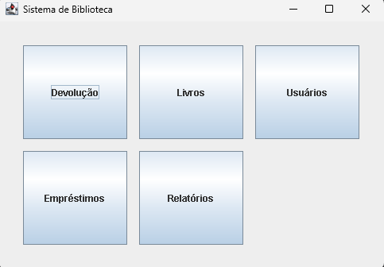
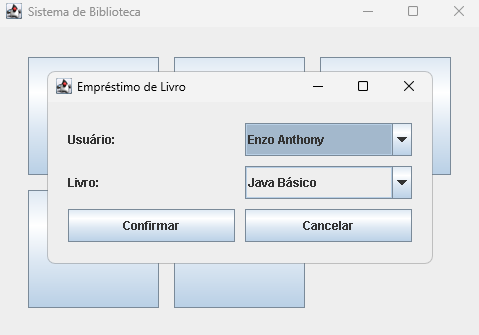
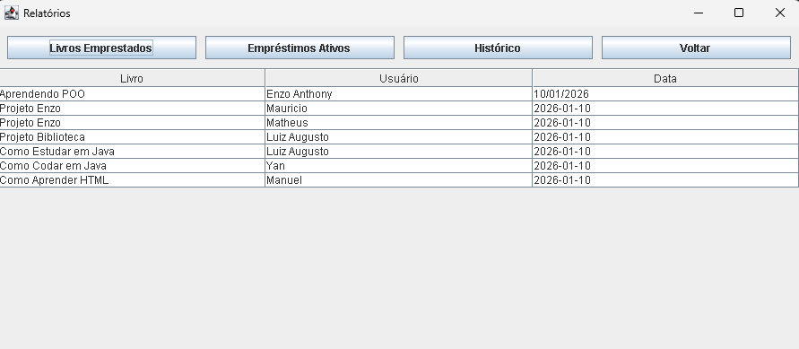

# 📚 Sistema de Gerenciamento de Biblioteca

Projeto desenvolvido em **Java** com foco em **Programação Orientada a Objetos**, **arquitetura em camadas (MVC/DAO)** e **persistência de dados com JDBC e MySQL**.  
O sistema simula o funcionamento de uma biblioteca, permitindo o controle completo de **usuários, livros e empréstimos**, incluindo relatórios e histórico.

---

## 🚀 Funcionalidades

### 👤 Usuários
- Cadastro de usuários
- Listagem de usuários
- Associação de usuários a empréstimos

### 📖 Livros
- Cadastro de livros
- Listagem de livros disponíveis
- Controle automático de status (Disponível / Emprestado)

### 🔄 Empréstimos
- Realização de empréstimos
- Validação para impedir empréstimo de livro já emprestado
- Devolução de livros
- Controle de empréstimos ativos

### 📊 Relatórios
- Listagem de todos os empréstimos
- Empréstimos em aberto
- Histórico completo de empréstimos
- Exibição de **usuário, livro, data e status**

---

## 🖼 Screenshots do Sistema

| Tela Menu | Empréstimo |
|-----------|------------|
|  |  |

| Relatório |
|-----------|
|  |

---

## 📐 Padrões Utilizados
- MVC (Model–View–Controller)  
- DAO (Data Access Object)  
- Programação Orientada a Objetos  
- JDBC  

---

## 🛠️ Tecnologias Utilizadas
- **Java** (JDK 8+)  
- **Swing** (Interface gráfica)  
- **MySQL** (Banco de dados)  
- **JDBC** (Conexão com banco)  
- **Git & GitHub** (Versionamento)  

---

## 🏷️ Tecnologias / Badges


 

 ## ⚙️ Como Executar o Projeto


```bash
1. Clone o repositório: git clone https://github.com/EnzoAnthony006/Biblioteca.git

2. Importe o projeto em uma IDE Java (IntelliJ, Eclipse ou NetBeans)

3. Configure o banco de dados MySQL:

Crie o schema biblioteca

Execute os scripts SQL das tabelas

4. Configure a classe Config.java:

public class Config {
    public static final String URL = "jdbc:mysql://localhost:3306/biblioteca";
    public static final String USUARIO = "root";
    public static final String SENHA = "sua_senha";

```
## 👨‍💻 Autor

Enzo Anthony
Estudante de Sistemas de Informação
Foco em Desenvolvimento Backend (Java) e AWS/Cloud

🔗 GitHub: https://github.com/EnzoAnthony006

---

🧱 Arquitetura do Projeto

O sistema segue boas práticas de engenharia de software, com separação de responsabilidades:

src
┣ 📂 Apresentacao → Telas Swing (JFrame, JTable, JButton)
┣ 📂 Controle → Regras de negócio
┣ 📂 Modelo → Entidades (Usuario, Livro, Emprestimo)
┣ 📂 Persistencia → DAO + JDBC
